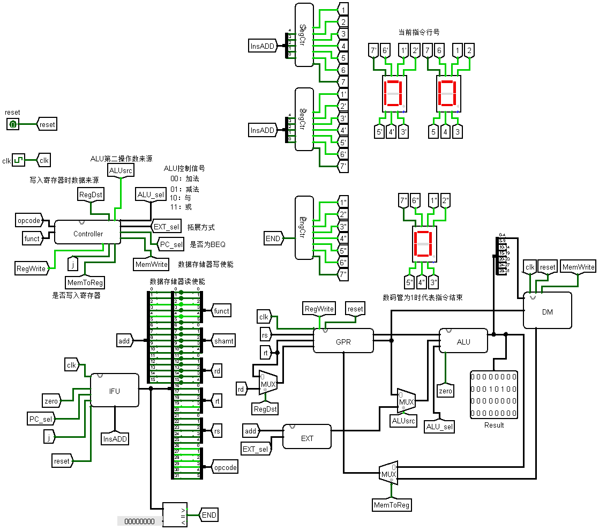

## 描述

本项目通过logisim实现了一个通过数字逻辑电路搭建的单周期通路的mips架构cpu,实现了以下指令:

{addu,subu,ori,lw,sw,beq,lui,j}

共实现了32个寄存器,同时实现了显示指令行号的功能模块.

总体的数据通路如下所示.若需测试指令的执行,请生成对应的十六进制代码后填入IFU模块的ROM中,再在整体数据通路中不断改变时钟信号即可进行指令的执行.

